# DemonTTS — The Inkosei Engine

> *"Oh, this? I just threw it together over the weekend."* — Teerth, lying through his teeth

## What This Actually Is (For People Who Actually Care)

DemonTTS is a **600-million-parameter multi-physics inference engine** that converts text into pressure waves via three neural networks that have no business being this complicated. But here we are.

If you're reading this hoping for a quick `pip install coqui-tts` experience, close this tab now. Go touch grass. This project is what happens when someone decides that *"good enough"* is for people who don't own an RTX 4060 and a dangerously large ego.

---

## Architecture Overview (Try Not To Cry)

```mermaid
%%{init: {'theme': 'dark', 'themeVariables': { 'primaryColor': '#ff00ff', 'edgeLabelBackground':'#1a1a2e', 'tertiaryColor': '#00ffff'}}}%%
flowchart TB
    subgraph INPUT["📥 Input Layer (The Easy Part)"]
        TEXT["Text<br/>'It was a dark and stormy night...'"]
        VOICE["Voice Sample<br/>3 seconds of someone talking"]
    end

    subgraph TEACHER["🎓 SpeechT5 Teacher (Pretrained, Borrowed)"]
        TOK["Tokenizer<br/>~5K vocab"]
        T5["SpeechT5 Transformer<br/>144M params"]
        HIFIGAN["HiFi-GAN Vocoder<br/>~14M params"]
    end

    subgraph FARADAY["⚡ Faraday FDFD Solver<br/>~400M params<br/>The 'Oh God Why' Layer"]
        direction TB
        F_IN["Input Mel [B,1,80,T]"]
        F_TEXT["Text Projection<br/>512 → 512"]
        F_SPK["Speaker Projection<br/>256 → 512"]
        F_FUSE["FiLM Fusion<br/>Material Properties"]
        F_TIME["Time Embedding<br/>Sinusoidal + MLP"]
        F_ENC["Encoder<br/>256→512→1024→2048<br/>3 ResBlocks/level<br/>Self-Attention @ L2,L3"]
        F_BOT["Bottleneck<br/>2048 ch × 3 Blocks<br/>Dual Self-Attention"]
        F_DEC["Decoder<br/>2048→1024→512→256<br/>3 ResBlocks/level<br/>Skip Connections"]
        F_OUT["Output Conv<br/>→ 1 ch residual"]
        F_RES["Residual Add<br/>input + predicted_residual"]
    end

    subgraph VOCODER["🔊 Vocoder Bridge"]
        V_MEL["Enhanced Mel @ 16kHz"]
        V_RESAMP["Resample<br/>16kHz → 24kHz"]
    end

    subgraph AETHER["🌊 Aether Transformer Filter<br/>~100M params<br/>The 'It Gets Worse' Layer"]
        direction TB
        A_WAV["Input Waveform [B,1,T]"]
        A_MEL["Mel Projection<br/>Conv1d 7×7 + 3×3<br/>80 → 768"]
        A_F0["F0 Projection<br/>Conv1d 7×7 + 3×3<br/>1 → 192"]
        A_ENG["Energy Projection<br/>Conv1d 7×7 + 3×3<br/>1 → 192"]
        A_SPK["Speaker Projection<br/>MLP 192 → 1152"]
        A_CAT["Concatenate<br/>→ [B,T,1152]"]
        A_PROJ["Input Proj<br/>1152 → 768"]
        A_POS["Sinusoidal Positional Encoding"]
        A_TRANS["Transformer Stack<br/>12 Layers × 12 Heads<br/>d_model=768, d_ff=3072<br/>Pre-Norm + GELU"]
        A_NORM["LayerNorm"]
        A_OUT_MLP["Output MLP<br/>768 → 768 → 128"]
        A_UPSAMP["Upsample Coeffs<br/>T_mel → T_wav"]
        A_LATTICE["Lattice Filter Bank<br/>128 parallel SOS filters<br/>Log-spaced bandpass"]
        A_SUM["Channel Sum<br/>→ [B,1,T]"]
    end

    subgraph OUTPUT["📤 Output (Finally)"]
        FLAC["FLAC / WAV<br/>24kHz, 16-bit"]
    end

    TEXT --> TOK
    VOICE -->|"ECAPA-TDNN<br/>5.5M params"| SPK_EMB["Speaker Embedding<br/>192-dim"]
    TOK --> T5
    T5 -->|"Mel [80,T]"| F_IN
    SPK_EMB --> F_SPK
    F_TEXT --> F_FUSE
    F_SPK --> F_FUSE
    F_TIME --> F_FUSE
    F_FUSE --> F_ENC
    F_IN --> F_ENC
    F_ENC --> F_BOT
    F_BOT --> F_DEC
    F_DEC --> F_OUT
    F_OUT --> F_RES
    F_IN -.->|"skip"| F_RES
    F_RES --> V_MEL
    V_MEL --> HIFIGAN
    HIFIGAN --> V_RESAMP
    V_RESAMP --> A_WAV
    V_RESAMP -->|"mel transform"| A_MEL
    A_WAV --> A_LATTICE
    A_MEL --> A_CAT
    A_F0 --> A_CAT
    A_ENG --> A_CAT
    A_SPK --> A_CAT
    A_CAT --> A_PROJ
    A_PROJ --> A_POS
    A_POS --> A_TRANS
    A_TRANS --> A_NORM
    A_NORM --> A_OUT_MLP
    A_OUT_MLP --> A_UPSAMP
    A_UPSAMP --> A_LATTICE
    A_LATTICE --> A_SUM
    A_SUM --> FLAC

    style FARADAY fill:#ff00ff20,stroke:#ff00ff,stroke-width:3px
    style AETHER fill:#00ffff20,stroke:#00ffff,stroke-width:3px
    style F_BOT fill:#ff000020,stroke:#ff0000,stroke-width:2px
    style A_TRANS fill:#ff000020,stroke:#ff0000,stroke-width:2px
```



---

## The Core Insight That Took Me 20 Minutes And Will Take You 3 Weeks

### Faraday as a "Decoupled FDFD Solver" (Yes, Really)

Finite-Difference Frequency-Domain solvers solve the Helmholtz equation:

```
∇²E + k²ε(x,y)E = S(x,y)
```

Faraday's U-Net is a **learned preconditioner**. The mapping:

| FDFD Concept | Faraday Implementation | Your Confusion Level |
|--------------|------------------------|---------------------|
| 2D spatial grid | Mel spectrogram `[B, 1, 80, T]` | Mildly concerned |
| Source term `b` | Noisy input field | Starting to worry |
| Field `E` | Clean target field | Moderately alarmed |
| Material `ε(x,y)` | FiLM conditioning (text + speaker) | Visibly sweating |
| System matrix `A` | Implicit in 400M conv kernels | Full panic |
| Residual prediction | U-Net output | Existential dread |

The **decoupling** means you can change text/speaker (material properties) without retraining the spatial solver. This is exactly how PINNs work, except I implemented it in my bedroom while you were watching Netflix.

### Multi-Purpose Usage (Because One Mode Is For Cowards)

1. **Diffusion Mode** (generative): 10-step DDIM sampling. Good for artistic enhancement.
2. **Supervised Mode** (deterministic): Direct residual prediction. No sampling. We use this because waiting for 10 diffusion steps per sentence would make audiobook generation take longer than reading the book yourself.
3. **Physical Mode** (theoretical): Add Helmholtz residual loss. Not implemented because I'm not *that* masochistic.

---

## Parameter Budget (Or: How I Learned to Stop Worrying and Love VRAM)

| Module | Params | Role | VRAM (fp16) | Training Time (RTX 4060) |
|--------|--------|------|-------------|-------------------------|
| SpeechT5 | 144M | Text → Mel (borrowed) | ~288 MB | N/A (pretrained) |
| HiFi-GAN | ~14M | Mel → Wave (borrowed) | ~28 MB | N/A (pretrained) |
| **Faraday U-Net** | **~400M** | Mel enhancement (FDFD) | **~800 MB** | **~12-16h** |
| **Aether Transformer** | **~100M** | Waveform polish | **~200 MB** | **~8-12h** |
| Speaker Encoder | ~5.5M | Voice cloning | ~11 MB | N/A (pretrained) |
| **Total (active)** | **~520M** | | **~1.3 GB** | **~20-28h** |
| **Total (with frozen)** | **~663M** | | **~1.6 GB** | |

Fits in 8GB VRAM with room for a small village. Your move, 4090 owners.

---

## Training Pipeline (For The Brave)

### Prerequisites

```bash
pip install torch torchaudio numpy soundfile pygame customtkinter pypdf pdfplumber tokenizers transformers
# Oh, and an RTX 4060. Or better. Much better.
```

### Phase 0: Parse Your Book (The Only Easy Part)

```bash
python pdf_parser.py --input ./book/ --output ./book_parsed/
```

This extracts chapters and speaker labels. It's basically regex with extra steps.

### Phase 1: Generate Synthetic Training Data

We use pretrained SpeechT5 as a "teacher" because training a TTS from scratch requires more compute than most nation-states possess.

```bash
python generate_training_data.py \
  --text_source ./book/ \
  --output_dir ./data \
  --num_pairs 1000
```

**Corruption strategies** (because clean data is boring):
- **Faraday**: Gaussian noise + spectral masking + time masking + mild blur
- **Aether**: Gaussian noise + codec compression + mild clipping

No human recordings required. The model learns from itself like a digital ouroboros.

### Phase 2: Train Faraday (Supervised Mode)

```bash
python training/train_faraday_supervised.py \
  --data_dir ./data/faraday_pairs \
  --output_dir checkpoints/faraday \
  --batch_size 4 \
  --epochs 50
```

Batch size is 4 because 400M params in fp16 with AdamW states takes ~4GB just for optimizer states. Welcome to the 8GB VRAM life.

**Time**: ~12-16 hours. Go outside. Touch grass. Call your mother.

### Phase 3: Train Aether

```bash
python training/train_aether_supervised.py \
  --data_dir ./data/aether_pairs \
  --output_dir checkpoints/aether \
  --batch_size 4 \
  --epochs 50
```

**Time**: ~8-12 hours. By now you've forgotten what sunlight looks like.

### Phase 4: Run the Orchestrator (Because Typing 3 Commands Is Too Hard)

```bash
python train_all.py --num_pairs 1000 --faraday_epochs 50 --aether_epochs 50
```

This runs everything sequentially. Like a civilized person.

### Phase 5: Generate Audiobooks

```bash
python gui.py
```

Dark theme with neon accents because we're not savages.

Or batch-process your entire library:
```bash
python cloud/batch_audiobook.py \
  --book_dir ./book/ \
  --output_dir ./audiobook/ \
  --workers 1
```

---

## Faraday's General-Purpose API (Yes, It Works On Other Things Too)

Because Faraday is fundamentally an FDFD solver, you can use it for any 2D field enhancement task:

```python
from faraday.model import FaradayDiffusion

solver = FaradayDiffusion(
    text_dim=512,
    speaker_dim=256,
    cond_dim=512,       # because 128 is for children
    base_channels=256,  # because 64 is for ants
)

# Mode 1: Diffusion (generative, slow, artistic)
enhanced = solver.enhance(corrupted_field, steps=10)

# Mode 2: Supervised (deterministic, fast, practical)
# This is what we actually use because diffusion is overrated
enhanced = solver.supervised_enhance(corrupted_field, text_emb, speaker_emb)
```

The only requirement is input shape `[B, 1, H, W]`. For audio, `H=80` (mel bins) and `W=T` (time). For EM simulations, `H` and `W` are Yee-cell grid dimensions. For fluid dynamics, it's pressure fields. I don't know why you'd use a 400M parameter audio model for fluid dynamics, but you *could*.

---

## Aether's Transformer Filter Bank (Or: How I Learned to Stop Worrying and Love Attention)

Aether uses a **12-layer transformer** (not an LSTM — LSTMs are for 2017) to predict time-varying reflection coefficients for 128 parallel second-order IIR filters.

```python
from aether.model import AetherFilter

filter_net = AetherFilter()
refined_waveform = filter_net(
    waveform=wav,           # [B, 1, T]
    mel=mel,                # [B, 80, T_mel]
    speaker_emb=spk,        # [B, 192]
    f0=f0,                  # [B, 1, T_mel] — pitch contour
    energy=energy,          # [B, 1, T_mel] — energy contour
)
```

The lattice structure guarantees stability: all poles inside the unit circle. This is important because unstable filters sound like a dial-up modem having a seizure.

---

## Cloud Compute (For When Your 4060 Catches Fire)

Because some of you have *libraries* of books and a single GPU just won't cut it:

```bash
# Docker Compose (local simulation)
docker-compose -f cloud/docker-compose.yml --profile batch up

# Modal.com serverless
cd cloud && modal deploy modal_deploy.py

# RunPod serverless
# Upload cloud/runpod_handler.py as your handler

# Batch process 100 books across 8 GPUs
python cloud/batch_audiobook.py \
  --book_dir /mnt/library/ \
  --output_dir /mnt/audiobooks/ \
  --gpu_ids 0,1,2,3,4,5,6,7 \
  --workers 8
```

---

## The Rust Pipeline (Optional, For Masochists)

For production inference, export to ONNX and run via Rust:

```bash
# Export models
cd demon-tts && python -c "from demo_tts import DemonTTS; tts = DemonTTS(); tts.export_all_onnx()"

# Run Rust pipeline
cd pipeline && cargo run --release --bin demon-tts
```

The Rust crate uses `ort` (ONNX Runtime) with CUDA EP. It's faster than Python because it's compiled and doesn't have a GIL. Also because Rust developers enjoy suffering.

---

## Voice Cloning (Steal Anyone's Voice In 3 Seconds)

Zero-shot speaker cloning via ECAPA-TDNN:

```python
from demo_tts import DemonTTS

tts = DemonTTS()
embedding = tts.clone_voice("speaker_3sec_sample.wav")
tts.voices["My Clone"] = embedding
tts.save_voices()
```

Only 3 seconds needed. The encoder extracts a 192-dimensional embedding from mel-spectrogram statistics. It's scarily accurate and slightly ethically concerning.

---

## Performance Targets

| Metric | Target | Actual | Notes |
|--------|--------|--------|-------|
| RTF (real-time factor) | ≤ 0.1 | ~0.05-0.08 | Python: 0.08, Rust: ~0.03 |
| VRAM usage | ≤ 8GB | ~3-4GB | fp16 inference |
| Book translation speed | 1 book/hour | ~45-60 min | 300-page novel |
| Quality | "Human-like" | "Uncanny valley adjacent" | Gets better with training |

---

## Folder Structure

```
./book/              # Input PDFs (the raw material)
./book_parsed/       # Cached JSON chapters (the structured material)
./audiobook/         # Output FLAC + combined audiobook (the product)
./data/              # Synthetic training pairs (the digital ouroboros)
./models/            # Checkpoints (.pt) + tokenizer + voices
./faraday/           # 400M-parameter FDFD solver core
./aether/            # 100M-parameter transformer filter bank
./neural/            # Student + SpeakerEncoder + HiFi-GAN stubs
./pipeline/          # Rust ONNX inference engine (for the brave)
./training/          # Lightning training scripts (for the patient)
./cloud/             # Cloud deployment configs (for the wealthy)
./gui.py             # CustomTkinter audiobook factory (for the lazy)
```

---

## FAQ

**Q: Why is this so complicated?**
A: Because simple solutions don't get GitHub stars.

**Q: Can I just use Coqui TTS instead?**
A: Yes. You can also use a bicycle instead of a Ferrari. Both get you there. One is more fun.

**Q: Will this run on my laptop?**
A: If your laptop has an RTX 4060 or better, yes. If not, no. Buy a GPU or use the cloud configs.

**Q: Why 600M parameters?**
A: Because 200M sounded too reasonable and I have a point to prove.

**Q: Is this over-engineered?**
A: The U-Net has self-attention at multiple levels, a 12-layer transformer processes audio frame-by-frame, and we're using a pretrained TTS model to train two other models that enhance its output. What do you think?

**Q: How long did this take?**
A: Longer than I'm willing to admit. Shorter than it would take you to reproduce it from scratch. That's the important part.

---

## License

MIT. Do whatever. Build a multiverse. Start a podcast narrated by AI clones of your friends. Don't blame me if it becomes sentient and starts criticizing your taste in literature.

---

*Built with excessive caffeine, questionable sleep schedules, and the unshakeable belief that 600 million parameters is a perfectly reasonable size for a hobby project.*

*Wubba lubba dub dub.*
