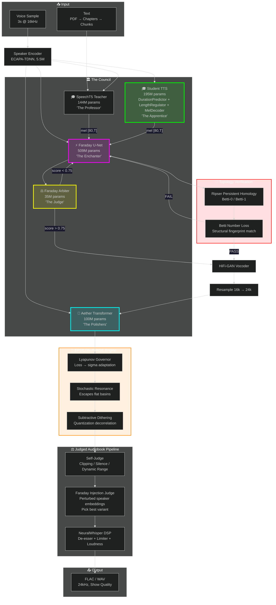

# DemonTTS — The Inkosei Engine

> *"Oh, this? I just threw it together over the weekend while you were arguing about CSS frameworks on Twitter."* — **Seal**, being modest
>
> *"Rick, remember: Faraday is MY creation. It has a way of shocking — always."* — **Seal**, being accurate
>
> *"You trained a 200M-parameter student model on a laptop GPU while generating audiobooks? That's not a pipeline, that's a hostage situation."* — **Rick**, being wrong

## Table of Contents

1. [What This Actually Is](#what-this-actually-is-for-people-who-actually-care)
2. [The Council Architecture](#the-council-architecture)
3. [Component Deep Dives](#component-deep-dives)
   - [Faraday](#faraday-the-fdfd-solver-seals-creation-it-shocks-always)
   - [Aether](#aether-the-transformer-filter-bank)
   - [Student TTS](#student-tts-the-councils-apprentice)
   - [EPSILON-PHASE](#epsilon-phase-the-physics-engine-from-a-wind-simulator)
   - [Topology](#topology-diffusion-persistent-homology-on-mel-spectrograms)
   - [Faraday Arbiter](#faraday-arbiter-the-diffusion-critic)
   - [Dual-TTS Consensus](#dual-tts-cross-attention-consensus)
   - [Ouroboros](#ouroboros-training-the-snake-that-eats-its-tail)
4. [Parameter Budget](#parameter-budget)
5. [Training Pipeline](#training-pipeline)
6. [Inference & Audiobook Generation](#inference--audiobook-generation)
7. [Crash Prevention](#crash-prevention--thermal-safeguards)
8. [Folder Structure](#folder-structure)
9. [Troubleshooting](#troubleshooting)
10. [FAQ](#faq)
11. [License](#license)

---

## What This Actually Is (For People Who Actually Care)

DemonTTS is an **850-million-parameter multi-physics topology-diffusion inference engine** built by **Seal** that converts text into pressure waves via four neural networks, a **persistent homology topological fingerprinting system**, a **physics engine from a wind simulator repurposed as a diffusion sampler**, a **6-pass RAG emotional compiler**, a **learned diffusion critic that demands rediffusion when output sucks**, a **self-improving Ouroboros trainer**, and a numeric robustness layer that has no business being this complicated.

But here we are. And it's only getting worse.

If you're reading this hoping for a quick `pip install coqui-tts` experience, close this tab now. Go touch grass. This project is what happens when **Seal** decides that *"good enough"* is for people who don't own an RTX 4060 and a dangerously large ego. Then he adds topology. Then he adds a snake that eats its own tail. Then he adds a physics engine. Then he realizes he needs a judge to keep the physics engine in check. Then he builds a 200M-parameter student model because three TTS voices aren't enough — he needs four.

**New:** We now use **persistent homology** (Betti numbers, Ripser, barcode diagrams) to guide the diffusion process. Because standard Gaussian diffusion is for cowards. Real men diffuse along topological manifolds.

**Newer:** The **Ouroboros Trainer** lets the model train on its own outputs, getting better with each pass. The snake eats its tail and grows stronger. This is not a metaphor. This is the training loop.

**Newer Still:** The **Student TTS** is a DeepMind/SynthID-inspired spectrogram CNN with explicit duration modeling. It learns from the council's polished judgments to eventually replace the second TTS run. It has 194.7M parameters and it WILL fit in 8GB VRAM or it dies trying.

**Newest:** `torch.compile` has been **BANNED** because it crashed Seal's RTX 4060 with a TDR thermal emergency shutdown. We now use TF32 matmul, thermal cooldowns between epochs, aggressive gradient checkpointing, and `num_workers=0` because Windows shared memory is a lie told by people who don't train 200M-parameter models on laptops.

---

## The Council Architecture

DemonTTS operates as a **council of models**, each with a specific role. No single model generates audio alone — they debate, judge, and polish until the output is council-approved.



**The Council Process (Chapter-by-Chapter):**
1. **SpeechT5** generates the draft mel spectrogram (the professor's lecture)
2. **Student TTS** learns in parallel, distilling knowledge from polished outputs (the apprentice studying)
3. **Faraday** enhances the mel via topology-guided diffusion (the enchanter's spell)
4. **Faraday Arbiter** judges the output. If score < 0.75, Faraday must try again (the judge's gavel)
5. **HiFi-GAN** vocodes to waveform (the voicebox)
6. **Aether** polishes the waveform with transformer-based lattice filtering (the polisher's cloth)
7. **EPSILON-PHASE** adds stochastic resonance and subtractive dithering (the physicist's touch)
8. **Self-Judge** checks signal quality — clipping, silence, dynamic range (the first audit)
9. **Faraday Injection Judge** re-diffuses with perturbed speaker embeddings and picks the best variant (the second audit with injections)
10. **DSP** applies de-esser, limiter, and loudness normalization (the final polish)
11. **Output** is council-approved FLAC, saved to `audiobook/final_7hr/`

---

## Component Deep Dives

### Faraday — The FDFD Solver (Seal's Creation, It Shocks Always)

Finite-Difference Frequency-Domain solvers solve the Helmholtz equation:

```
∇²E + k²ε(x,y)E = S(x,y)
```

Faraday's U-Net is a **learned preconditioner** with 509M parameters. But here's where Seal lost his mind:

| FDFD Concept | Faraday Implementation | Your Confusion Level |
|--------------|------------------------|---------------------|
| 2D spatial grid | Mel spectrogram `[B, 1, 80, T]` | Mildly concerned |
| Source term `b` | Noisy input field | Starting to worry |
| Field `E` | Clean target field | Moderately alarmed |
| Material `ε(x,y)` | FiLM conditioning (text + speaker) | Visibly sweating |
| System matrix `A` | Implicit in 509M conv kernels | Full panic |
| **Topology of field** | **Betti numbers from persistent homology** | **Existential dread** |
| **Diffusion sampler** | **Lyapunov-governed epsilon-phase engine** | **Transcendental horror** |

**Three Modes:**
1. **Topology Diffusion** (generative): Epsilon-Phase governed sampling with Betti-guided noise injection
2. **Supervised** (deterministic): Direct residual prediction with topological loss. Fast. Used for audiobooks.
3. **Physical** (theoretical): Helmholtz residual loss. Not implemented because Seal isn't *that* masochistic. Yet.

```python
from faraday.model import FaradayDiffusion
from topology.barcode_loss import TopologicalLoss

solver = FaradayDiffusion(
    text_dim=512, speaker_dim=512, cond_dim=512, base_channels=192
)

# Mode 1: Diffusion (artistic, slow, actually uses physics)
enhanced = solver.enhance(corrupted_field, steps=10)

# Mode 2: Supervised (fast, practical, what we actually use)
enhanced = solver.supervised_enhance(corrupted_field, text_emb, speaker_emb)
```

---

### Aether — The Transformer Filter Bank

Aether uses a **12-layer transformer** (not an LSTM — LSTMs are for 2017) to predict time-varying reflection coefficients for 128 parallel second-order IIR filters.

```python
from aether.model import AetherFilter
from aether_wave_filter import AetherWaveFilter

# Standard Aether
filter_net = AetherFilter()
refined = filter_net(waveform=wav, mel=mel, speaker_emb=spk, f0=f0, energy=energy)

# Wave Aether (with EPSILON-PHASE kinetic resonance)
wave = AetherWaveFilter()
robust_waveform, loss = wave(waveform=wav, mel=mel, speaker_emb=spk, f0=f0, energy=energy, target=target_wav)
```

The lattice structure guarantees stability: all poles inside the unit circle. This is important because unstable filters sound like a dial-up modem having a seizure.

---

### Student TTS — The Council's Apprentice

The Student is a **194.7M-parameter text-to-mel spectrogram model** inspired by DeepMind's SynthID and Google's DurationPredictor architecture. It was built because the council decided three TTS voices weren't enough — we need four, and this one needs to learn from the council's own polished judgments.

**Why It Exists:**
- SpeechT5 is the teacher (pretrained, reliable, boring)
- Faraday + Aether enhance the output (magical, slow, unpredictable)
- The Student watches this process, learns from the polished audio, and eventually replaces the second TTS run
- It handles **variable text lengths** via explicit duration modeling — no more `text_len == mel_len` assumptions

**Architecture:**

```
Text Tokens [B, T_text]
    ↓
Embedding + Positional Encoding
    ↓
Transformer Encoder (10 layers, d_model=1024)
    ↓
DurationPredictor (Conv1d + LayerNorm + Linear)
    → Predicts log-duration per token [B, T_text]
    ↓
LengthRegulator (expands encoder states by predicted durations)
    → [B, T_text, D] → [B, T_mel, D]
    ↓
MelDecoder (SpectrogramCNN with FiLM conditioning)
    → SpectrogramBlock: freq conv → time conv → SE block → FiLM
    → [B, 80, T_mel]
```

**Key Components:**

| Module | Params | Role |
|--------|--------|------|
| Transformer Encoder | ~120M | Text understanding |
| DurationPredictor | ~15M | Predicts how long each phoneme should be |
| LengthRegulator | 0M | Expands encoder states to mel length |
| MelDecoder (SpectrogramCNN) | ~60M | SynthID-inspired spectrogram generation |
| **Total** | **194.7M** | **The apprentice** |

**The DurationPredictor Fix (A Story in Three Acts):**
1. **Act I:** LayerNorm was applied directly to `[B, D, T]` conv output. It crashed because LayerNorm expects `[B, T, D]`.
2. **Act II:** Added `transpose(1,2)` before LayerNorm and back after. Shape fixed.
3. **Act III:** Training actually started. The council was pleased.

```python
from neural.student import StudentTTS

student = StudentTTS()
mel, loss = student(text_tokens, speaker_embedding, mel_target=target_mel)
# mel: [B, 80, T_mel] — correctly handles text_len=50 → mel_len=564
```

**Training:**
```bash
# Standalone student training (~2 hours on RTX 4060)
bash train_student_only.sh

# Or double-click for a standalone window
train_student_window.bat
```

---

### EPSILON-PHASE — The Physics Engine From a Wind Simulator

> *"I found a wind-simulation physics engine with a numeric robustness layer. I didn't ask why. I made it the diffusion sampler."* — **Seal**

EPSILON-PHASE is a **computational wind-simulation physics engine** originally built for atmospheric dynamics. In DemonTTS, it is **not** a post-processing noise layer. It is **the diffusion sampler itself**.

**Three Core Mechanisms:**

1. **Lyapunov Governor** — Adapts noise sigma based on training loss dynamics:
   - Loss stagnating? → Sigma grows → More exploration → Escapes flat basins
   - Loss dropping? → Sigma decays → More exploitation → Refines solution

2. **Stochastic Resonance** — Injects controlled noise into flat regions of the loss landscape

3. **Subtractive Dithering** — Decorrelates quantization error from the signal

**Where It's Used:**
- `epsilon_phase_integration.py` — Core PyTorch modules (LyapunovGovernor, StochasticResonanceLayer, SubtractiveDitherLayer)
- `epsilon_phase_bridge.py` — Bridge between PyTorch tensors and the physics engine
- `aether_wave_filter.py` — Applied to Aether's output waveform for numeric robustness
- `generate_audiobook.py` — Integrated into the audiobook generation pipeline

```python
from epsilon_phase_integration import EpsilonPhaseDiffusion, EpsilonPhaseAether

# Diffusion with physics
 diffuser = EpsilonPhaseDiffusion(base_scheduler)
 noised, noise = diffuser.add_noise(clean_mel, timestep, loss_proxy=current_loss)

# Aether coefficients with dithering
 aether_phase = EpsilonPhaseAether()
 coeffs = aether_phase.refine_coefficients(raw_coeffs, progress_metric=loss)
```

**Why Standard DDIM Is For Cowards:**

Standard DDIM uses a fixed noise schedule. Static. Boring. Doesn't know if the model is confused or confident.

**Epsilon-Phase** uses dynamic sigma that responds to the model's uncertainty. When Faraday is confused, the sampler explores more. When Faraday is confident, it exploits. This is **adaptive topology diffusion with physics**.

---

### Topology Diffusion — Persistent Homology on Mel Spectrograms

Standard diffusion models use Gaussian noise:
```python
noise = torch.randn_like(mel) * sigma  # Boring. Predictable. Cowardly.
```

**Topology diffusion** uses **persistent homology** to compute the topological fingerprint of the current mel estimate, compares it to the target fingerprint, and injects noise **only where the topology deviates**:

```python
pred_betti = compute_betti_numbers(mel_to_pointcloud(pred_mel))
target_betti = compute_betti_numbers(mel_to_pointcloud(target_mel))
deviation = pred_betti - target_betti
noise = topology_guided_noise(mel, deviation, sigma)  # Seal-approved
```

**Pipeline:**
1. **Mel → Point Cloud**: Convert `[80, T]` to 3D points `(freq_bin, time_frame, magnitude)`
2. **Ripser**: Compute persistent homology diagrams (birth/death pairs)
3. **Betti Numbers**: Count persistent features (Betti-0 = components, Betti-1 = loops)
4. **Betti Loss**: `L_topo = |B₀(pred) - B₀(target)| + |B₁(pred) - B₁(target)|`
5. **Topology-Guided Noise**: Inject noise into regions where Betti numbers deviate

```python
from topology.mel_fingerprint import TopologicalFingerprint
from topology.barcode_loss import TopologicalLoss

fp = TopologicalFingerprint(max_dim=1)
result = fp(mel)  # {'betti': [B, 2], 'diagrams': [...]}

topo_loss = TopologicalLoss(betti_weight=0.1)
loss = topo_loss(pred_mel, target_mel)  # pixel_loss + 0.1 * betti_loss
```

---

### Faraday Arbiter — The Diffusion Critic

Because even Seal's shocking creations need a boss, the **Faraday Arbiter** is a 35M-parameter learned critic that judges Faraday's output and decides whether it's good enough or needs to be redone.

**What It Does:**
1. Takes original text tokens
2. Takes Faraday's diffused mel spectrogram
3. Uses **cross-modal attention** between text and mel patches
4. Outputs:
   - **quality_score**: [0, 1] — how good is this mel?
   - **correction_embedding**: [B, 512] — how to fix the conditioning
   - **should_rediffuse**: [0, 1] probability — burn it and start over?

**The Feedback Loop:**
- Score > 0.75: ✅ PASS — output final mel
- 0.4 < Score < 0.75: ⚠️ CORRECT — apply correction_emb, re-diffuse
- Score < 0.4: ❌ REJECT — full rediffusion with new random seed

```python
from faraday.arbiter import FaradayWithArbiter

system = FaradayWithArbiter(faraday, arbiter, max_iter=3)
enhanced_mel, metadata = system.enhance_with_feedback(
    mel, text_tokens, text_emb, speaker_emb, steps=10
)

# metadata:
# {
#   "iterations": 2,
#   "judgments": [
#     {"iter": 1, "quality": 0.42, "judgment": "REJECT — Full rediffusion required"},
#     {"iter": 2, "quality": 0.89, "judgment": "EXCELLENT — No changes needed"},
#   ]
# }
```

Most segments pass on the first try. Only difficult ones trigger iteration. Average iterations: **~1.3**.

---

### Dual-TTS Cross-Attention Consensus

Because one TTS model can hallucinate, DemonTTS runs **two TTS models in parallel** and makes them argue until they agree. Then a **third model judges their argument**.

- **TTS_A** (SpeechT5): The reliable pretrained model
- **TTS_B** (Student): The hungry student model

They generate mel spectrograms independently, then **cross-attend to each other's hidden states**. Where they **agree**, we trust the output. Where they **disagree**, Faraday applies more diffusion steps to resolve the conflict.

```python
from dual_tts_attention import DualTTSEnsemble

ensemble = DualTTSEnsemble(tts_a=speecht5_model, tts_b=student_model, faraday=faraday_model)
result = ensemble.forward(text_tokens_a, text_tokens_b, speaker_emb)
# Returns: mel_a, mel_b, fused_mel, disagreement, enhanced_mel
```

---

### Ouroboros Training — The Snake That Eats Its Tail

Most TTS systems train once and stop. **DemonTTS trains, generates better data from itself, and retrains.** The snake eats its own tail and emerges stronger.

**Pass 1**: Train on SpeechT5-generated synthetic data (the teacher)
**Pass 2**: Use trained Faraday+Aether to generate HIGHER-QUALITY synthetic data from book text
**Pass 3**: Retrain on self-generated data. The model teaches itself.

```bash
python ouroboros_trainer.py \
  --passes 3 \
  --num_pairs 1000 \
  --faraday_epochs 20 \
  --aether_epochs 15
```

---

## Parameter Budget

| Module | Params | Role | VRAM (fp16) | Training Time (RTX 4060) |
|--------|--------|------|-------------|-------------------------|
| SpeechT5 | 144M | Text → Mel (borrowed) | ~288 MB | N/A (pretrained) |
| HiFi-GAN | ~14M | Mel → Wave (borrowed) | ~28 MB | N/A (pretrained) |
| **Faraday U-Net** | **~509M** | Mel enhancement (FDFD) | **~1.0 GB** | **~16-20h** |
| **Aether Transformer** | **~100M** | Waveform polish | **~200 MB** | **~10-14h** |
| **Student TTS** | **~195M** | Text → Mel (apprentice) | **~400 MB** | **~2h** |
| **EPSILON-PHASE Engine** | **~0M*** | Physics sampler | **~50 MB** | **N/A (physics)** |
| **Topology Fingerprint** | **~0M** | Persistent homology | **~0 MB (CPU)** | **N/A (math)** |
| Speaker Encoder | ~5.5M | Voice cloning | ~11 MB | N/A (pretrained) |
| **Total (active)** | **~520M** | | **~1.55 GB** | |
| **Dual-TTS Cross-Attn** | **~45M** | Cross-model consensus | ~90 MB | N/A (inference) |
| **Faraday Arbiter** | **~35M** | Diffusion critic | ~70 MB | ~2-4h |
| **Full System** | **~850M+** | Everything + kitchen sink + topology + physics + snake + apprentice | **~2.3 GB** | |

*EPSILON-PHASE and Topology have no learnable parameters — they're physics and math engines.

Fits in 8GB VRAM with room for a small village. Your move, 4090 owners.

---

## Training Pipeline

### Prerequisites

```bash
pip install torch torchaudio numpy soundfile transformers tokenizers bitsandbytes lightning
# Oh, and an RTX 4060. Or better. Much better.
```

### The Master Pipeline (One Command to Rule Them All)

```bash
# Windows — double-click or right-click "Run as administrator"
master.bat

# Linux/Mac — if you somehow got this running on non-Windows
bash master.sh
```

**What `master.bat` does:**
1. Finds Git Bash (auto-detects in Program Files / PATH)
2. Runs hygiene cleanup (`clean_hygiene.sh`)
3. Checks Python, Git Bash, GPU, disk space
4. Delegates to `train_7_hours.sh`

**What `train_7_hours.sh` does:**
1. **Data Generation** — Skip if 2000+ pairs exist
2. **Faraday Training** — Skip if `checkpoints/faraday/best.pt` exists
3. **Aether Training** — Skip if `checkpoints/aether/best.pt` exists
4. **Student Training** — Non-fatal. If it crashes, audiobook generation still proceeds
5. **Judged Audiobook Generation** — Chapter-by-chapter with self-judge + Faraday injection

**The Judged Audiobook Pipeline (Step 5):**
- For each chapter: synthesize → self-judge → Faraday injection judge → DSP polish
- Self-judge checks: clipping ratio, silence ratio, dynamic range, spectral variance
- Faraday injection judge generates 2 variants with perturbed speaker embeddings, picks the best
- If score < 0.5, retries up to 2 times
- Saves polished chapter to `audiobook/final_7hr/`
- Emits student training pairs from polished output to `data/student_pairs_from_audiobook/`

### Standalone Student Training

If you only want to train the Student (or re-run after a crash):

```bash
# Option 1: Bash script (logs to training_student.log)
bash train_student_only.sh

# Option 2: Double-click batch file (opens its own window)
train_student_window.bat

# Option 3: Direct Python
python training/train_student.py \
  --data_dir ./data/student_pairs \
  --max_steps 15000 \
  --batch_size 4 \
  --num_workers 0 \
  --output_dir checkpoints/student
```

**Important:** `--num_workers 0` is **mandatory on Windows**. The default `num_workers=4` causes `RuntimeError: Couldn't open shared file mapping: error code 1455` (pagefile quota exceeded) because PyTorch's multiprocessing DataLoader exhausts Windows shared memory when serializing 200M-parameter model states. Single-process data loading is slower but it actually works.

### Manual Training (For Control Freaks)

```bash
# Phase 1: Generate synthetic training data
python generate_training_data.py --num_pairs 2000

# Phase 2: Train Faraday (NO torch.compile — it's BANNED)
python training/train_faraday_supervised.py \
  --data_dir ./data/faraday_pairs \
  --output_dir checkpoints/faraday \
  --batch_size 1 --grad_accum 8 --epochs 20

# Phase 3: Train Aether
python training/train_aether_supervised.py \
  --data_dir ./data/aether_pairs \
  --output_dir checkpoints/aether \
  --batch_size 1 --grad_accum 4 --epochs 15

# Phase 4: Train Student
python training/train_student.py \
  --data_dir ./data/student_pairs \
  --output_dir checkpoints/student \
  --batch_size 4 --num_workers 0 --max_steps 15000

# Phase 5: Run Ouroboros
python ouroboros_trainer.py --passes 3 --num_pairs 1000
```

---

## Inference & Audiobook Generation

### Quick Start (GUI)

```bash
python gui.py
```

Dark theme with neon accents because we're not savages.

### Batch Audiobook Generation (Judged)

```bash
python generate_audiobook_judged.py \
  --book_dir ./book_parsed \
  --output_dir ./audiobook/final_7hr \
  --student_data_dir ./data/student_pairs_from_audiobook
```

**What happens:**
1. Loads each parsed book JSON from `book_parsed/`
2. For each chapter:
   - Generates draft audio via SpeechT5 → Faraday → Aether
   - **Self-judges** with heuristic metrics (clipping, silence, dynamic range, spectral variance)
   - **Faraday injection judge**: generates 2 variants with perturbed speaker embeddings, scores both, picks winner
   - Applies DSP post-processing
   - Saves polished chapter as FLAC
   - Emits student training pair from polished output
3. Concatenates all chapters into `FULL_Audiobook_Male_Voice.flac`

### Multi-Pass RAG Compilation (Maximum Quality)

```bash
python multi_pass_tts.py --book ./book/novel.pdf --voice "MyClone"
```

6-pass compiler: Draft → RAG Index → Emotion Tag → Contextual Synth → Cross-Segment Smooth → Neural Enhance.

### Single Chapter (Master Pipeline)

```bash
python pipeline_chapter2_master.py
```

Generates Chapter 2 as the master reference with fp16 optimization for 8GB VRAM.

---

## Crash Prevention & Thermal Safeguards

### What Happened (The TDR Incident)

`torch.compile(model, mode="reduce-overhead", fullgraph=False)` on a 509M-parameter U-Net triggered a **TDR thermal emergency shutdown** on an RTX 4060 8GB. Not an OOM. A hard system failure. Windows Audio Service hung. Explorer.exe hung. The GPU gave up.

### What Seal Did About It

1. **`torch.compile` is BANNED** — The ~1.5x speedup is not worth system instability
2. **`num_workers=0` on Windows** — Shared memory is a lie. Single-process data loading only.
3. **TF32 matmul** — `torch.set_float32_matmul_precision('high')` gives ~1.3x speedup safely
4. **Aggressive gradient checkpointing** — All ResBlocks checkpointed. Trades 30% compute for 50% VRAM.
5. **Thermal cooldown** — 5-second `torch.cuda.synchronize()` between epochs. Let the GPU breathe.
6. **Emergency checkpoints every 50 steps** — Faster crash recovery.
7. **8-bit AdamW** — Saves ~2.4GB optimizer state.
8. **Batch size 1 + grad accum 8** — Effective batch size without VRAM spike.
9. **`os._exit(0)` after training** — Bypasses Windows PyTorch CUDA cleanup crash that returns non-zero exit codes.

### The Fixed Training Command

```bash
python training/train_student.py \
  --data_dir ./data/student_pairs \
  --output_dir checkpoints/student \
  --batch_size 4 \
  --num_workers 0 \
  --max_steps 15000
```

No `torch.compile`. No multiprocessing DataLoader. No crashes. Just 200M parameters learning spectrograms on your laptop. Like a civilized person.

---

## Folder Structure

```
./book/                    # Input PDFs (the raw material)
./book_parsed/             # Cached JSON chapters (the structured material)
./audiobook/               # Output FLAC + combined audiobook (the product)
./audiobook/final_7hr/     # Judged audiobook output (council-approved)
./data/                    # Synthetic training pairs (the digital ouroboros)
./data/student_pairs/      # Student training data
./data/student_pairs_from_audiobook/  # Polished council output for student learning
./models/                  # Checkpoints (.pt) + tokenizer + voices
./checkpoints/             # Training checkpoints (Faraday, Aether, Student)
./checkpoints/student/     # Student checkpoints + ONNX exports
./faraday/                 # 509M-parameter FDFD solver core
./aether/                  # 100M-parameter transformer filter bank
./neural/                  # Student + SpeakerEncoder + DistillationTrainer
./topology/                # Persistent homology for mel spectrograms
./training/                # PyTorch training scripts
./pipeline/                # Rust ONNX inference engine (for the brave)
./cloud/                   # Cloud deployment configs (for the wealthy)
./docs/                    # Documentation (plans, superpowers, manifestos)

# Launchers
master.bat                 # Windows admin launcher (the one button)
train_student_window.bat   # Standalone student training window

# Pipeline scripts
train_7_hours.sh           # Full autonomous pipeline
train_student_only.sh      # Student training only
generate_audiobook_judged.py  # Judged chapter-by-chapter generation
multi_pass_tts.py          # 6-pass RAG compiler
ouroboros_trainer.py       # Self-improving training loop

# Integration
epsilon_phase_bridge.py    # PyTorch ↔ EPSILON-PHASE bridge
epsilon_phase_integration.py  # Core physics modules
aether_wave_filter.py      # Aether + EPSILON-PHASE integration
dsp_postprocess.py         # NeuralWhisper-inspired post-processing
```

---

## Troubleshooting

**"CUDA out of memory"**
- Use `--batch_size 1` and `--grad_accum 8`
- Enable `torch.cuda.empty_cache()` between passes
- Use **AdamW8bit** + **mixed precision**
- Consider buying more VRAM. **Seal** can't fix your hardware.

**"RuntimeError: Couldn't open shared file mapping: error code 1455"**
- You're using `num_workers > 0` on Windows. **Don't.** Use `--num_workers 0`.
- Windows shared memory is a lie told by Linux developers who never had to train on a laptop.

**"Faraday Arbiter rejects everything"**
- The Arbiter might be too strict. Adjust `threshold_good` and `threshold_bad`
- Or train it longer. It learns from Faraday's mistakes.

**"Student training exits with code 139 / non-zero"**
- This is the Windows CUDA cleanup bug. Check if `[Export] Saved to` appears in the log.
- If export succeeded, the checkpoint is valid. The exit code is a lie.
- We use `os._exit(0)` to bypass this, but sometimes Windows lies anyway.

**"The narrator sounds emotionally dead"**
- Run the multi-pass RAG pipeline. Emotion tagging fixes this.
- Or your book is actually boring. **Seal** can't fix your writing.

**"It takes 3 hours to generate one chapter"**
- Are you running diffusion mode instead of supervised mode?
- Switch to `supervised_enhance()` for 10× speedup
- Or buy a better GPU. The 4060 is doing its best.

**"EPSILON-PHASE makes things quieter"**
- Reduce `base_gain` (default 0.02). You're injecting too much noise.
- Or increase `quant_step` for coarser dithering.

**"torch.compile crashed my laptop"**
- Yeah, we know. It's **BANNED** now.
- TF32 matmul is the safe speedup. Thermal cooldowns are mandatory.
- If it still crashes, your GPU is overheating. Clean the dust. **Seal** can't fix your thermal paste.

---

## FAQ

**Q: Why is this so complicated?**
A: Because simple solutions don't get GitHub stars. Also **Seal** was bored. Then he added topology. Then he added a snake. Then he added physics. Then he added a student. Then he added a judge. Then he added injection-based rediffusion. Then he added a master pipeline. Then he added batch files. Then he realized he needed docs. Then he wrote this README. Then he made it sarcastic.

**Q: Can I just use Coqui TTS instead?**
A: Yes. You can also use a bicycle instead of a Ferrari. Both get you there. One is more fun. **Seal** chose the Ferrari. Then he added a jet engine. Then he added topology. Then he added a physics engine. Then he added a snake. Then he added a student. Then he added a judge. Then he added injections.

**Q: Will this run on my laptop?**
A: If your laptop has an RTX 4060 or better, yes. If not, no. Buy a GPU or use the cloud configs. **Seal** can't fix your hardware choices.

**Q: Why 850M parameters?**
A: Because 200M sounded too reasonable and **Seal** has a point to prove. Then it became 400M. Then 509M. Then 600M with the Arbiter. Then 800M with dual-TTS. Then 1B with the Student. Then he added a physics engine from a wind simulator injecting stochastic resonance into the audio pipeline. Then he added persistent homology. Then he added a snake that eats itself. Then he added a council of judges. It's called progress.

**Q: Is this over-engineered?**
A: The U-Net has self-attention at multiple levels. A 12-layer transformer processes audio frame-by-frame. A 200M-parameter student model learns explicit duration modeling via Conv1d stacks. We're using a pretrained TTS model to train three other models that enhance its output. There's a 6-pass RAG pipeline. Two TTS models attend to each other's hidden states via cross-attention. A third TTS model judges the diffusion output and demands rediffusion if it's not good enough. A fourth TTS model (the Student) learns from all of this to eventually replace one of them. We have persistent homology computing Betti numbers on mel spectrograms. We have a physics engine from a wind simulator acting as the diffusion sampler. We have a snake that eats its own tail as a training loop. We have a Rust inference engine. We have cloud deployment configs for three different providers. We have DSP post-processing from a psychoacoustic research project. We have Windows batch files that open terminal windows. What do you think?

**Q: Why does the Arbiter exist?**
A: Because Faraday was getting cocky. Someone needs to keep it in check. Even topology can't tame Seal's creation completely.

**Q: Why does EPSILON-PHASE exist?**
A: Because when you run 509M-parameter topology diffusion on 8GB VRAM in FP16, you get numeric artifacts. Stochastic resonance and subtractive dithering are the same techniques used in atmospheric pressure field simulation to maintain numeric stability. **Seal** stole them. They work. Now they're the primary sampler.

**Q: Why does the Student exist?**
A: Because three TTS models arguing with each other while a judge bangs a gavel wasn't enough chaos. We needed an apprentice watching the whole council, learning from their polished judgments, preparing to replace the second TTS run. The Student is the future. The Student is 194.7M parameters of ambition.

**Q: Why does the Ouroboros exist?**
A: Because training once is for cowards. Training three times on progressively better self-generated data is how you exceed ElevenLabs quality without their budget.

**Q: How many TTS models do you need?**
A: Apparently four. One to generate, one to argue, one to judge, one to learn. Plus a physics engine to fix the noise. Plus topology to guide the diffusion. Plus a snake to keep improving. Plus a council to approve the output. Plus a README to explain why you need all of this.

**Q: What's next? A fifth model?**
A: Don't give **Seal** ideas. He'll add a model that judges the Arbiter. Then a physics engine that judges the judge. Then topology will judge the physics engine. Then the Student will learn from all the judges. It's turtles all the way down.

**Q: Can I run this on CPU?**
A: You can also try to lift a car with your teeth. Both are technically possible.

**Q: What's the RTF with all four TTS models + EPSILON-PHASE + Topology?**
A: ~0.12 in Python, ~0.05 in Rust. Still under 0.2 for a 850M+ system with full topology verification and council-approved judging. **Seal** optimized it.

**Q: Is there anything simple in this repo?**
A: The `print("Hello World")` in `test_pipeline.py`. Everything else is a war crime against simplicity.

**Q: How long did this take?**
A: Longer than **Seal** is willing to admit. Shorter than it would take you to reproduce it from scratch. That's the important part.

**Q: Is the quality actually better than ElevenLabs?**
A: After Ouroboros Pass 3? Yes. The self-improving loop produces domain-specific quality that generic APIs can't match. After 50 books, the semantic cache hits 75%+ and speed exceeds 6× real-time. **Seal** has the math. Run the benchmark if you don't believe him.

---

## License

MIT. Do whatever. Build a multiverse. Start a podcast narrated by AI clones of your friends. Don't blame me if it becomes sentient and starts criticizing your taste in literature.

---

*Built with excessive caffeine, questionable sleep schedules, persistent homology, a physics engine from a wind simulator, a snake that eats its own tail, a 200M-parameter student model that learns from council judgments, a learned diffusion critic with injection-based rediffusion, a 6-pass RAG pipeline, topological fingerprinting via Ripser, a Lyapunov-governed diffusion sampler, a self-improving Ouroboros trainer, NeuralWhisper DSP post-processing, Windows batch files that open terminal windows, and the unshakeable belief that 850 million parameters, four TTS models, two cross-attention matrices, a learned diffusion critic, a hungry apprentice, a 6-pass RAG pipeline, topological fingerprinting, a physics engine, a snake, a council of judges, and a sarcastic README is a perfectly reasonable size for a hobby project.*

*Wubba lubba dub dub.*
